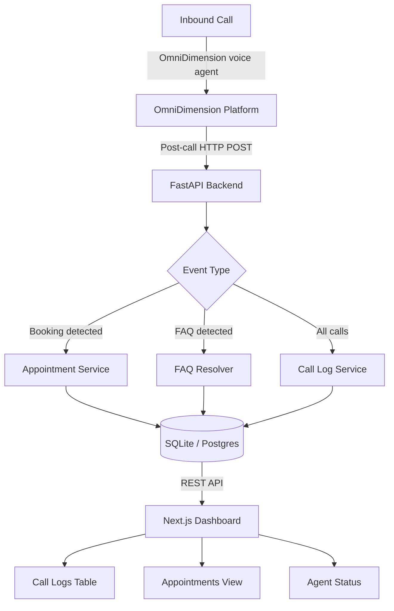

# Voice Receptionist

> An open-source, deployable AI voice receptionist for local businesses — powered by [OmniDimension](https://omnidim.io).

Handle inbound calls, book appointments, and answer FAQs automatically. The AI agent answers the phone so your staff doesn't have to. A live dashboard gives you full visibility into every call and booking.

---

## Features

- **AI-powered inbound call handling** via OmniDimension voice agent
- **Automatic appointment booking** — agent extracts patient name, service, and requested time from conversation
- **FAQ resolution** — fuzzy-match caller questions against a per-business knowledge base
- **Real-time dashboard** — call logs table, appointments view, live agent status indicator
- **Per-business config** — one YAML file controls business name, hours, services, and FAQs
- **Demo seed script** — populates realistic dummy data so the dashboard looks alive on first run
- **Zero-dependency boot** — works with placeholder env vars; no real OmniDimension account needed to run locally
- **Structured logging** + health-check endpoint for production monitoring
- **Webhook signature verification** (HMAC-SHA256) for secure OmniDimension integration

---

## Architecture



---

## Tech Stack

| Layer | Technology |
|---|---|
| AI Voice Agent | OmniDimension (omnidim.io) |
| Backend | Python 3.11, FastAPI, SQLAlchemy (async), Pydantic v2 |
| Database | SQLite (dev) / PostgreSQL (prod) via SQLAlchemy |
| Frontend | Next.js 14, TypeScript, Tailwind CSS |
| UI Components | Custom components + Lucide icons |
| Config | pydantic-settings, YAML business config |
| Seed / Dev | Faker |

---

## Quick Start

### Prerequisites

- Python 3.11+
- Node.js 18+
- An OmniDimension account (optional — placeholder values work for local demo)

### 1. Clone the repo

```bash
git clone https://github.com/mayank-xrz/voice-receptionist.git
cd voice-receptionist
```

### 2. Backend setup

```bash
cd backend
cp ../.env.example .env          # edit with your real values (or leave placeholders)
pip install -r requirements.txt
uvicorn app.main:app --reload    # http://localhost:8000
```

API docs auto-generated at http://localhost:8000/docs

### 3. Seed demo data (optional but recommended)

```bash
cd ..
python scripts/seed.py           # populates 25 calls + 20 appointments
```

### 4. Frontend setup

```bash
cd frontend
cp ../.env.example .env.local    # only NEXT_PUBLIC_API_URL is needed
npm install
npm run dev                      # http://localhost:3000
```

### 5. Configure your business

Edit `backend/business_config.yaml`:

```yaml
business:
  name: "Your Business Name"
  phone: "+1-555-0100"
  timezone: "America/New_York"

hours:
  monday: "09:00-17:00"
  # ...

services:
  - name: "Service Name"
    duration_minutes: 30
    price_usd: 99

faqs:
  - question: "Do you accept insurance?"
    answer: "Yes, we accept..."
```

---

## Environment Variables

| Variable | Default | Description |
|---|---|---|
| `OMNIDIM_API_KEY` | `sk-omni-placeholder` | OmniDimension API key from your dashboard |
| `OMNIDIM_AGENT_ID` | `agent_placeholder_id` | OmniDimension voice agent ID |
| `OMNIDIM_WEBHOOK_SECRET` | `whsec_placeholder` | HMAC signing secret for webhook verification |
| `OMNIDIM_BASE_URL` | `https://backend.omnidim.io/api/v1` | OmniDimension API base URL |
| `APP_ENV` | `development` | `development` or `production` |
| `APP_SECRET_KEY` | `change-me` | Secret key for session signing |
| `DATABASE_URL` | `sqlite+aiosqlite:///./voice_receptionist.db` | SQLAlchemy async database URL |
| `LOG_LEVEL` | `INFO` | Python logging level |
| `CORS_ORIGINS` | `["http://localhost:3000"]` | Allowed CORS origins (JSON array) |
| `NEXT_PUBLIC_API_URL` | `http://localhost:8000` | Backend URL for the Next.js frontend |

> Never commit a `.env` file with real secrets. See `.env.example` for safe placeholder values.

---

## OmniDimension Configuration

### 1. Create a voice agent

1. Sign up at [omnidim.io](https://omnidim.io)
2. Create a new voice agent and select a phone number
3. Configure the agent's system prompt to collect: `patient_name`, `service`, `appointment_datetime` (ISO 8601 format), and optionally `patient_email` and `notes`
4. Add your business knowledge base (FAQs) as a document in the agent's knowledge base

### 2. Configure the webhook

In the OmniDimension dashboard → your agent → **Post-Call** tab:

- Set delivery method to **Webhook**
- Set the webhook URL to: `https://your-domain.com/api/v1/webhooks/omnidim`
- Copy the signing secret and set it as `OMNIDIM_WEBHOOK_SECRET`

### 3. Map extracted variables

Configure your OmniDimension agent to extract these variables during the conversation:

| Variable | Example value |
|---|---|
| `patient_name` | `Jane Smith` |
| `service` | `Routine Cleaning` |
| `appointment_datetime` | `2025-07-15T10:00:00` |
| `patient_email` | `jane@example.com` |
| `notes` | `First-time patient, referred by Dr. Jones` |

The backend reads these from `call_report.extracted_variables` in the webhook payload and automatically creates an appointment record.

---

## How It Works

1. **Caller dials your business number** → OmniDimension answers immediately
2. **Voice agent converses** using your business context (hours, services, FAQs) stored in OmniDimension's knowledge base
3. **After the call ends**, OmniDimension fires a POST webhook to `/api/v1/webhooks/omnidim`
4. **Backend processes the event**:
   - Stores a `CallLog` record with the transcript and AI summary
   - If booking variables are present → creates an `Appointment` record
   - If it's an FAQ call → logs the matched question for analytics
5. **Dashboard updates** — the Next.js frontend polls the API every 60 seconds and displays all activity

---

## API Reference

Full interactive docs at `http://localhost:8000/docs` (Swagger UI) and `http://localhost:8000/redoc`.

| Method | Path | Description |
|---|---|---|
| `GET` | `/health` | Health check |
| `POST` | `/api/v1/webhooks/omnidim` | Receive OmniDimension post-call webhook |
| `GET` | `/api/v1/calls` | List call logs (paginated) |
| `GET` | `/api/v1/calls/{id}` | Get single call |
| `GET` | `/api/v1/appointments` | List appointments (paginated, filterable by status) |
| `POST` | `/api/v1/appointments` | Manually create appointment |
| `PATCH` | `/api/v1/appointments/{id}` | Update appointment |
| `DELETE` | `/api/v1/appointments/{id}` | Cancel appointment |
| `GET` | `/api/v1/faq` | List all FAQs |
| `POST` | `/api/v1/faq/query` | Query FAQ by question string |

---

## Demo Screenshots

> _Screenshots / GIF coming soon — run the seed script and open http://localhost:3000 to see the live dashboard._

---

## Deployment

See [docs/deployment.md](docs/deployment.md) for:
- Railway / Render / Fly.io one-click deployment
- Switching from SQLite to PostgreSQL
- Setting up a custom domain with HTTPS (required for OmniDimension webhooks)

---

## Roadmap

- [ ] Email/SMS appointment confirmation via Twilio or SendGrid
- [ ] Google Calendar / Calendly sync
- [ ] Multi-location support (one deployment, many businesses)
- [ ] Real-time dashboard updates via WebSockets
- [ ] Vector-based FAQ search (replace difflib with embeddings)
- [ ] OmniDimension outbound call dispatch UI
- [ ] Docker Compose one-command setup
- [ ] Stripe payment collection during the call

---

## OmniDimension API Notes

This project was built against the OmniDimension API as documented in June 2025.

- **Base API URL:** `https://backend.omnidim.io/api/v1`
- **Auth:** `Authorization: Bearer YOUR_API_KEY`
- **Post-call webhooks:** configured per-agent in the dashboard's Post-Call tab
- **Webhook payload shape:** documented at https://docs.omnidim.io/docs/dashboard-guides/post-call
- **Python SDK:** `pip install omnidimension` (latest release: September 2024)
- **Dispatch call endpoint:** `POST /calls/dispatch`

---

## License

MIT — see [LICENSE](LICENSE).

## Contributing

See [CONTRIBUTING.md](CONTRIBUTING.md).
